# CS50W - Project 4 - Network 

 

### Echo - A Social Media Site Inspired by Twitter
#### By Cory Suzuki - April 2024
<br>

### Quick Links
- Project Repo: https://github.com/MyPetLobster/network
- Demo Video: https://youtu.be/Mz61VeJU0_o
- Course Website: https://cs50.harvard.edu/web/2020/projects/4/network/

<br>

## Video Demo, Screenshots, and Gifs

**Submission Youtube Video**

<a href="https://youtu.be/Mz61VeJU0_o"></a>


## Project Specifications

### 1. New Post:
Users who are signed in can create a new post. As with all other user-initiated content updates on my site, I accomplished this using asynchronous JavaScript. I used the Fetch API to send a POST request to the server with the new post content. The server then responded with the new post data, which I used to update the page without needing to refresh.

### 2. All Posts:
When a user visits the site, they should see all posts that have been made. Posts should be ordered from newest to oldest. I used Django's Paginator class to paginate the posts, with 10 posts per page. I also used Django's built-in template tags to loop through the posts and display them on the page. Each post includes the post content, the username of the user who made the post, the date and time at which the post was made, and the number of "likes" the post has received. If a user is signed in, there will be links to "like" and "unlike" the post, reply to posts, and edit their own posts.


### 3. Profile Page:
Users can click on a username to view that user's profile. The profile page displays the number of followers the user has, the number of people they follow, and all of their posts. If a user is signed in, there will be a "follow" or "unfollow" button on the profile page. When a user clicks the "follow" button, they will begin following that user. When a user clicks the "unfollow" button, they will stop following that user. There are also links to two additional pages that simply list all of the users that the user is following or all of the users that follow the user, with links to each of their profiles.


### 4. Following:
A user can also click on a link in the navigation bar to view all posts made by users that the current user follows. This page behaves like the "All Posts" page, but it only shows posts from users that the current user follows. Unlike the all posts page, this page does not include the button and form to create a new post. However, the following page (and profile page) both show all posts, including replies. Replies are hidden on the all posts page to keep the page clean and easy to read.

### 5. Pagination:
Pagination is implemented on the all posts, following, and profile pages. By default there are 10 posts per page, but I set up the code such that you can change the value at the top of the views.py by editing the PAGINATOR_RANGE. Also, I included both arrow and page number pagination controls. The current page is highlighted and the arrow controls are disabled when you are on the first or last page. I added a second paginator control at the top of the posts for convenience. That one is hidden by default until the user clicks on the little icon (see demo gifs or video).

### 6. Edit Post:
Users can edit their own posts. When a user clicks the "edit" button on one of their posts, the post content becomes an input field with the textarea filled with the post's current content. The user can then edit the content and click a "save" button to save the new content. The post content is updated on the page without needing to refresh. 

### 7. "Like" and "Unlike":
Users can "like" and "unlike" posts. When a user clicks the "like" button on a post, the text changes to "unlike" and the number of likes increases by one. When a user clicks the "unlike" button, the text changes to "like" and the number of likes decreases by one. The server keeps track of which users have liked which posts.


## Additional Features
3. **Landing Page** - I spent a few hours working on the logo for the site, and the only places you could really see it were on the navbar and in the tab title as a favicon. So truth be told, I only made the landing page in order to show off the logo and make it a little bigger. But I actually quite like the aesthetic of the landing page. If a user is not logged in, they will be presented with a link to login, register or continue as a visitor. If a user is logged in, they will see a link to go to all posts, following, or their own profile.

2. **Post Page and Replies** - I added a feature that allows users to reply to posts. When a user clicks the "reply" button on a post, a form that looks just like the create new post form will appear. The user can then type their reply and click a "save" button to save the new content. Replies are hidden on the all posts page to keep the page clean and easy to read. But they are displayed on the profile and following pages. A page will exist for each post that has replies. I love how the interface looks on this page. You see all the replies nested/descending below the original post. If you hover over a reply the z-index increases, bringing it to the front of the page. And if you click on a reply, it will expand to allow you to like the post and see more details.

* I opted not to allow replies to other replies. I didn't want to deal with endless nesting hell. I think if I were to continue working on this site, I would keep limitation in place, but I would add a feature that allows users to tag other users in their posts and replies and implement an inbox or notification system.


## Usage

### Optional -- Included Test Database
- A test database is included with sample data for testing and demonstration purposes. The test database includes 7 users, and about 100 posts. The database data, db.json, is located in the root folder. To use the test database, follow the instructions below.


### Installation and startup
1. Install Django.
2. Clone the project repository.
3. Set up the database and run migrations. (Optional: use the included test database)
4. Run the Django development server.


```bash
# 1. Install Django
pip install django

# 2. Clone the project repository
git clone <repo-url>
cd network

# Optional: Use the included test database
python manage.py loaddata db.json

# 3. Set up the database and run migrations
python manage.py makemigrations
python manage.py migrate

# 4. Run the Django development server
python manage.py runserver
```

## Things I Learned and Challenges

### 1. HTML dataset property: 
- In my project I needed a way to get assign user_id to follow/unfollow buttons. I learned about the dataset property in HTML which allows you to store custom data attributes in HTML elements. I used the dataset property to store the user_id in the follow/unfollow buttons so that I could access those values in my JavaScript functions.
##### HTML -
```     
 
    <button id="unfollow-button" class="follow-button btn btn-primary" data-profile-id="{{ profile_user.id }}">Unfollow</button>
    ...
```
##### JavaScript -
```
button.addEventListener("click", () => {
    const profileId = button.dataset.profileId;
    fetch(`/profile/${profileId}`, {
        ...
```

### 2. Django Paginator:
- In my last project I implemented pagination using only JavaScript. This time, I learned about Django's built-in Paginator class, which much like many other Django features, was incredibly simple to implement. I was able to paginate my posts with just a few lines of code. Then I spent the time I saved trying to make cool animations for the paginator controls. 


### 3. Django Settings Deep Dive:
- Once I had finished the project requirements, I wanted to challenge myself and add at least one extra feature that I've never implemented before. I decided to add a feature that would allow users to upload a profile picture. This was a great learning experience because it required me to dive deep into Django settings and learn about how to configure the media files settings (MEDIA_URL and MEDIA_ROOT). I also learned about the ImageField model field type and how to use the Pillow library to resize images. In the end, I ended up not even needing to use Pillow, but it was a great way to force myself to really understand how Django settings work.


## Closing Thoughts 
- I spent a lot of time on project 2, Commerce, and honestly feeling a little bit of self-doubt seeing how long it took me to finish that project. But since then I've been able to complete projects 3 and 4 in a much shorter amount of time. For both projects, I think I could have technically submitted them after only a few hours of work. But that doesn't include time spent styling and adding dynamic features. I think I've gotten better at estimating how long it will take me to complete a project and I'm getting better at managing my time. I'm very excited to move onto the capstone project. Since I started my coding journey, I've had an idea for an application. Until recently, it felt like an impossible task to build it. But now I feel like mayyyybbee I can pull it off. I'm gonna try at least. 


<br><br>
## Project Media and Demos

### Site Screenshots

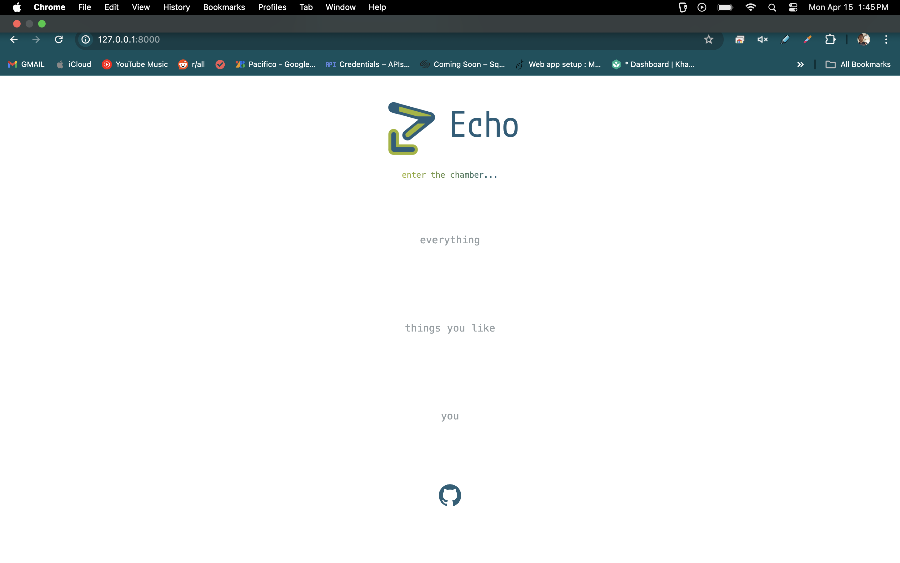
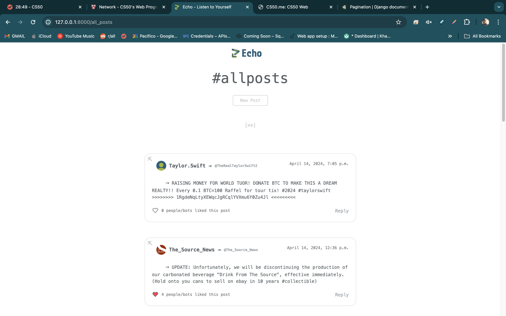
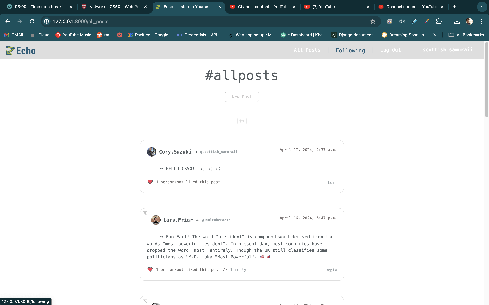
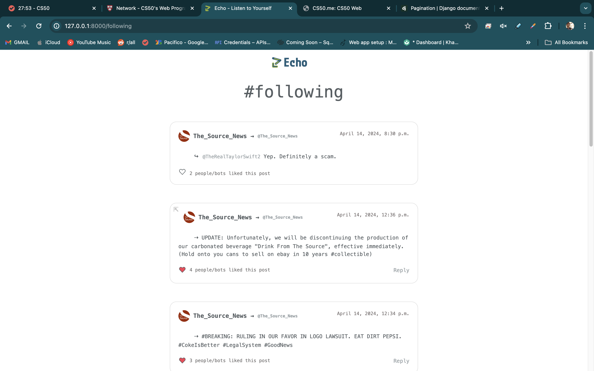
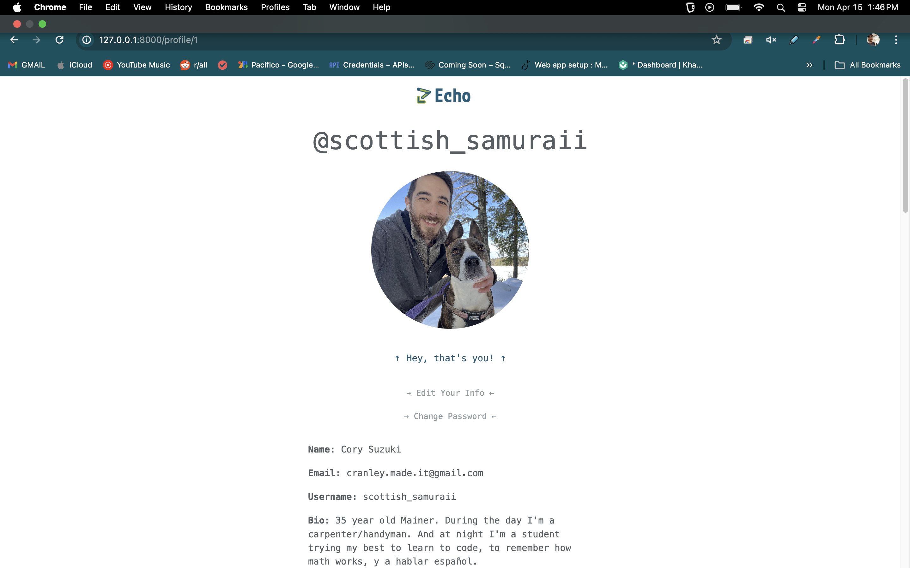
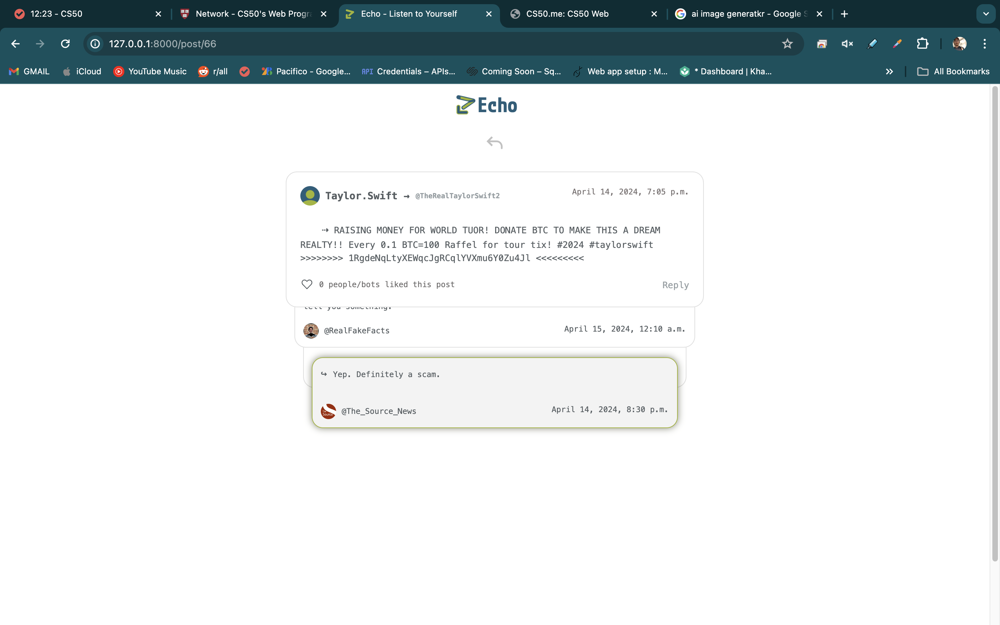
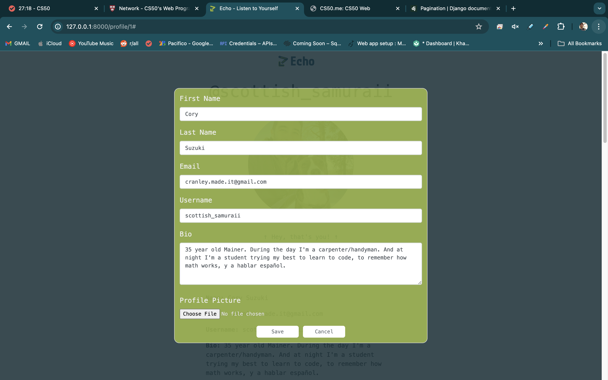
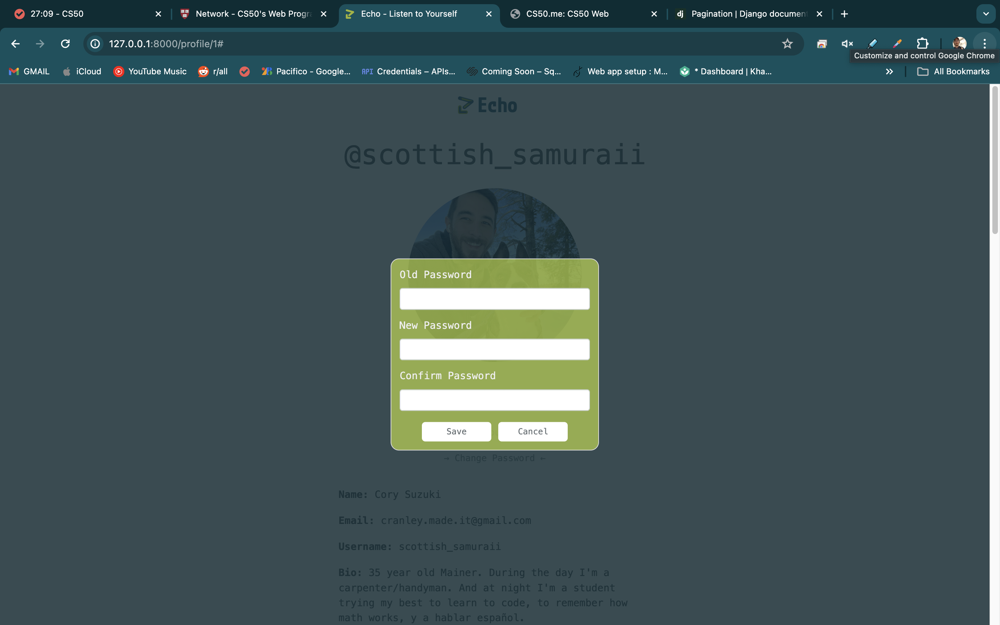

<br><br>

### Demo Gifs

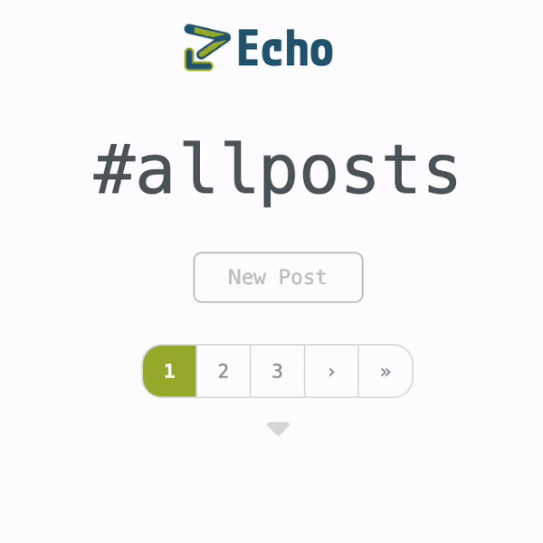 

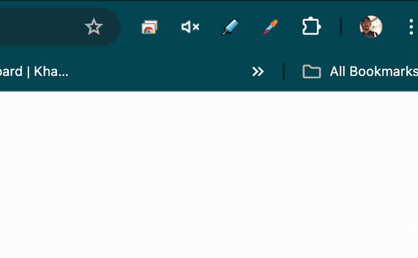 

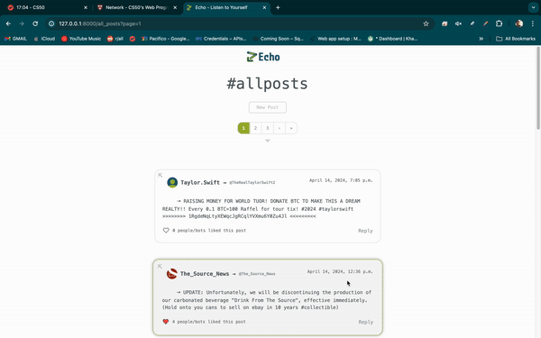 

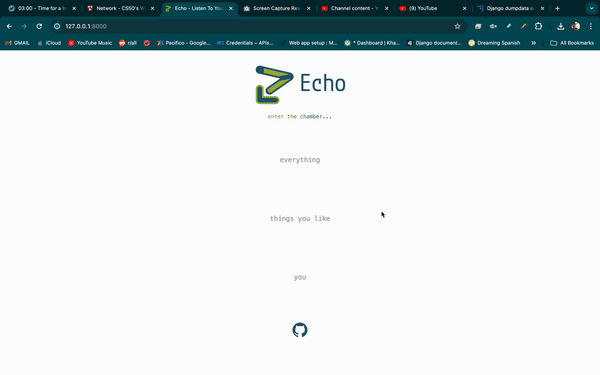

<br><br>

## Logo and Design
### Decided to design a logo for my site, Echo. Here are a few iterations and the final design.
### - Prototype/Planning - started with an 'E' and did some rearranging 


 
<br><br>

### - Final Logo Evolution


 

<br><br>

### - Default profile picture I "designed" this, aka realized default profile pics are often just two circles.


<br><br>
<br><br>

## Demo Database - User Profile Pictures
### I used DeepAi.org to generate some user profile pictures, here are the prompts, images, and links to view their full profiles. This is always my favorite part of working on these projects. 

#### 1. "A politician who was just informed he accidentally tweeted what was supposed to be a private google search." 

 

<a href="https://i.imgur.com/iBX1SWT.png">@GovJuddHumphries Full Profile</a>


#### 2. "Profile picture for a conspiracy theorist's twitter account"

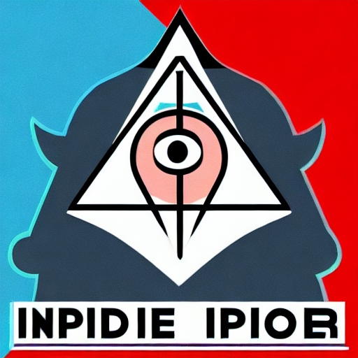 

<a href="https://i.imgur.com/dKUQJJs.png">@illuminati__insider1 Full Profile</a>


#### 3. "Profile picture of a snarky man who runs a parody twitter account called 'RealFakeFacts'"

 

<a href="https://i.imgur.com/zydzoMC.png">@RealFakeFacts Full Profile</a>

#### 4. "Picture of a blonde woman used by scammers running a fake Taylor Swift twitter account"

 

<a href="https://i.imgur.com/0zUgifL.png">@TheRealTaylorSwift Full Profile</a>

#### 5. I actually made this one myself. I honestly didn't realize I essentially combined the Coke and Pepsi logos until I was done. Ended up using that fact to create a backstory for this fictional news company.

 

<a href="https://i.imgur.com/GdcPG98.png">@TheSourceNews Full Profile</a>


### 6. All Posts Giant Screenshot
<a href="https://i.imgur.com/52fbyDp.png">Every Post and Reply (imgur)</a>